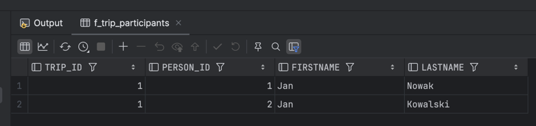
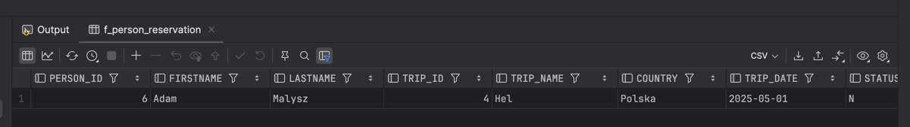
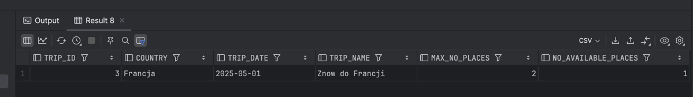

# Oracle PL/Sql

widoki, funkcje, procedury, triggery
ćwiczenie

---


Imiona i nazwiska autora : Paweł Czajczyk

---
<style>
  {
    font-size: 16pt;
  }
</style> 

<style scoped>
 li, p {
    font-size: 14pt;
  }
</style> 

<style scoped>
 pre {
    font-size: 10pt;
  }
</style> 

# Tabele


- `Trip`  - wycieczki
	- `trip_id` - identyfikator, klucz główny
	- `trip_name` - nazwa wycieczki
	- `country` - nazwa kraju
	- `trip_date` - data
	- `max_no_places` -  maksymalna liczba miejsc na wycieczkę
- `Person` - osoby
	- `person_id` - identyfikator, klucz główny
	- `firstname` - imię
	- `lastname` - nazwisko


- `Reservation`  - rezerwacje/bilety na wycieczkę
	- `reservation_id` - identyfikator, klucz główny
	- `trip_id` - identyfikator wycieczki
	- `person_id` - identyfikator osoby
	- `status` - status rezerwacji
		- `N` – New - Nowa
		- `P` – Confirmed and Paid – Potwierdzona  i zapłacona
		- `C` – Canceled - Anulowana
- `Log` - dziennik zmian statusów rezerwacji 
	- `log_id` - identyfikator, klucz główny
	- `reservation_id` - identyfikator rezerwacji
	- `log_date` - data zmiany
	- `status` - status


```sql
create sequence s_person_seq  
   start with 1  
   increment by 1;

create table person  
(  
  person_id int not null
      constraint pk_person  
         primary key,
  firstname varchar(50),  
  lastname varchar(50)
);

alter table person  
    modify person_id int default s_person_seq.nextval;
   
```


```sql
create sequence s_trip_seq  
   start with 1  
   increment by 1;

create table trip  
(  
  trip_id int  not null
     constraint pk_trip  
         primary key, 
  trip_name varchar(100),  
  country varchar(50),  
  trip_date date,  
  max_no_places int
);  

alter table trip 
    modify trip_id int default s_trip_seq.nextval;
```


```sql
create sequence s_reservation_seq  
   start with 1  
   increment by 1;

create table reservation  
(  
  reservation_id int not null
      constraint pk_reservation  
         primary key, 
  trip_id int,  
  person_id int,  
  status char(1)
);  

alter table reservation 
    modify reservation_id int default s_reservation_seq.nextval;


alter table reservation  
add constraint reservation_fk1 foreign key  
( person_id ) references person ( person_id ); 
  
alter table reservation  
add constraint reservation_fk2 foreign key  
( trip_id ) references trip ( trip_id );  
  
alter table reservation  
add constraint reservation_chk1 check  
(status in ('N','P','C'));

```


```sql
create sequence s_log_seq  
   start with 1  
   increment by 1;


create table log  
(  
    log_id int not null
         constraint pk_log  
         primary key,
    reservation_id int not null,  
    log_date date not null,  
    status char(1)
);  

alter table log 
    modify log_id int default s_log_seq.nextval;
  
alter table log  
add constraint log_chk1 check  
(status in ('N','P','C')) enable;
  
alter table log  
add constraint log_fk1 foreign key  
( reservation_id ) references reservation ( reservation_id );
```


---
# Dane


Należy wypełnić  tabele przykładowymi danymi 
- 4 wycieczki
- 10 osób
- 10  rezerwacji

Dane testowe powinny być różnorodne (wycieczki w przyszłości, wycieczki w przeszłości, rezerwacje o różnym statusie itp.) tak, żeby umożliwić testowanie napisanych procedur.

W razie potrzeby należy zmodyfikować dane tak żeby przetestować różne przypadki.


```sql
-- generacja danych


-- trip
insert into trip(trip_name, country, trip_date, max_no_places)
values ('Wycieczka do Paryza', 'Francja', to_date('2023-09-12', 'YYYY-MM-DD'), 3);
insert into trip(trip_name, country, trip_date, max_no_places)
values ('Piekny Krakow', 'Polska', to_date('2025-05-03','YYYY-MM-DD'), 2);
insert into trip(trip_name, country, trip_date, max_no_places)
values ('Znow do Francji', 'Francja', to_date('2025-05-01','YYYY-MM-DD'), 2);
insert into trip(trip_name, country, trip_date, max_no_places)
values ('Hel', 'Polska', to_date('2025-05-01','YYYY-MM-DD'), 2);

insert into trip(trip_name, country, trip_date, max_no_places)
values ('Zajecia', 'Wydzial', to_date('2027-12-11','YYYY-MM-DD'), 7);
insert into trip(trip_name, country, trip_date, max_no_places)
values ('Sladami Adolfa', 'Niemcy', to_date('1941-03-21','YYYY-MM-DD'), 7);
-- person
insert into person(firstname, lastname)
values ('Jan', 'Nowak');
insert into person(firstname, lastname)
values ('Jan', 'Kowalski');
insert into person(firstname, lastname)
values ('Jan', 'Nowakowski');
insert into person(firstname, lastname)
values ('Novak', 'Nowak');


insert into person(firstname, lastname)
values ('Maria', 'Curie');
insert into person(firstname, lastname)
values ('Adam', 'Malysz');
insert into person(firstname, lastname)
values ('Krzysztof', 'Piatek');
insert into person(firstname, lastname)
values ('Aleksandra', 'Matraszek');
insert into person(firstname, lastname)
values ('Zosia', 'Zych');
insert into person(firstname, lastname)
values ('Robert', 'Kubica');
-- reservation
-- trip1
insert into reservation(trip_id, person_id, status)
values (1, 1, 'P');
insert into reservation(trip_id, person_id, status)
values (1, 2, 'N');
-- trip 2
insert into reservation(trip_id, person_id, status)
values (2, 1, 'P');
insert into reservation(trip_id, person_id, status)
values (2, 4, 'C');
-- trip 3
insert into reservation(trip_id, person_id, status)
values (2, 4, 'P');

-- trip 4
insert into reservation(trip_id, person_id, status)
values (3, 7, 'P');
-- trip 5
insert into reservation(trip_id, person_id, status)
values (4, 6, 'N');
insert into reservation(trip_id, person_id, status)
values (4, 8, 'P');
insert into reservation(trip_id, person_id, status)
values (4, 10, 'P');
-- trip 6
insert into reservation(trip_id, person_id, status)
values (5, 1, 'P');
insert into reservation(trip_id, person_id, status)
values (5, 2, 'P');
-- trip 7
insert into reservation(trip_id, person_id, status)
values (6, 1, 'N');
insert into reservation(trip_id, person_id, status)
values (6, 2, 'P');


```

proszę pamiętać o zatwierdzeniu transakcji

---
# Zadanie 0 - modyfikacja danych, transakcje

Należy zmodyfikować model danych tak żeby rezerwacja mogła dotyczyć kilku miejsc/biletów na wycieczkę
- do tabeli reservation należy dodać pole
	- no_tickets
- do tabeli log należy dodac pole
	- no_tickets
	
Należy zmodyfikować zestaw danych testowych

Należy przeprowadzić kilka eksperymentów związanych ze wstawianiem, modyfikacją i usuwaniem danych
oraz wykorzystaniem transakcji

Skomentuj dzialanie transakcji. Jak działa polecenie `commit`, `rollback`?.
Co się dzieje w przypadku wystąpienia błędów podczas wykonywania transakcji? 
Porównaj sposób programowania operacji wykorzystujących transakcje w Oracle PL/SQL ze znanym ci systemem/językiem MS Sqlserver T-SQL


```text
commit - zatwierdza wszystkie zmiany wykonane w bieżącej transakcji, stają się one trwałe, nie można już cofnąć 
i są widoczne dla każdego
rollback - cofa wszystkie zmiany wykonane w bieżącej transakcji, przywraca stan przed rozpoczęciem transakcji

w przypadku błędu - możemy zadecydować, czy chcemy zatwierdzić bierzące zmiany, czy je cofnąć


w Oracle transakcje są automatycznie zarządzane, nie musimy ich jawnie rozpoczynać i kończyć 
natomiast w MS SQL Server musimy jawnie rozpocząć transakcję za pomocą polecenia `BEGIN TRANSACTION` 
i zakończyć ją za pomocą `COMMIT` lub `ROLLBACK`
```


```sql
-- modyfikacja tabeli RESERVATION i LOG
alter table RESERVATION
	add no_tickets int;

alter table LOG
	add no_tickets int;


-- dodanie kolumny no_tickets do tabeli RESERVATION i LOG
update RESERVATION
set no_tickets = 1
where RESERVATION_ID > 0;

update RESERVATION
set no_tickets = 2
where trip_id = 1 and person_id = 1;

-- dodanie danych do tabeli LOG i usunięcie rekordu
insert into LOG (reservation_id, log_date, status, no_tickets)
values (1, sysdate, 'N', 2);

insert into LOG (reservation_id, log_date, status, no_tickets)
values (2, sysdate, 'P', 5);

select * from LOG;

DELETE from LOG
where reservation_id = 2;

```

---
# Zadanie 1 - widoki


Tworzenie widoków. Należy przygotować kilka widoków ułatwiających dostęp do danych. Należy zwrócić uwagę na strukturę kodu (należy unikać powielania kodu)

Widoki:
-   `vw_reservation`
	- widok łączy dane z tabel: `trip`,  `person`,  `reservation`
	- zwracane dane:  `reservation_id`,  `country`, `trip_date`, `trip_name`, `firstname`, `lastname`, `status`, `trip_id`, `person_id`, `no_tickets`
- `vw_trip` 
	- widok pokazuje liczbę wolnych miejsc na każdą wycieczkę
	- zwracane dane: `trip_id`, `country`, `trip_date`, `trip_name`, `max_no_places`, `no_available_places` (liczba wolnych miejsc)
-  `vw_available_trip`
	- podobnie jak w poprzednim punkcie, z tym że widok pokazuje jedynie dostępne wycieczki (takie które są w przyszłości i są na nie wolne miejsca)


Proponowany zestaw widoków można rozbudować wedle uznania/potrzeb
- np. można dodać nowe/pomocnicze widoki, funkcje
- np. można zmienić def. widoków, dodając nowe/potrzebne pola

# Zadanie 1  - rozwiązanie

```sql
create or replace view vw_reservation
            (
             reservation_id,
             country,
             trip_date,
             trip_name,
             firstname,
             lastname,
             status,
             trip_id,
             person_id,
             no_tickets)
as
select reservation_id,
	   country,
	   trip_date,
	   trip_name,
	   firstname,
	   lastname,
	   status,
	   r.trip_id,
	   r.person_id,
	   no_tickets
from RESERVATION r
		 inner join TRIP t on r.TRIP_ID = t.TRIP_ID
		 inner join PERSON p on r.PERSON_ID = p.PERSON_ID;

create or replace view vw_trip
            (
             trip_id,
             country,
             trip_date,
             trip_name,
             max_no_places,
             no_available_places
                )
as
select t.trip_id,
	   t.country,
	   t.trip_date,
	   t.trip_name,
	   t.max_no_places,
	   t.max_no_places - nvl(sum_tickets.total_tickets, 0) as no_available_places
from trip t
		 left join
	 (select trip_id,
			 sum(no_tickets) as total_tickets
	  from reservation
	  where status <> 'C'
	  group by trip_id) sum_tickets on t.trip_id = sum_tickets.trip_id;

create or replace view vw_available_trip
            (
             trip_id,
             country,
             trip_date,
             trip_name,
             max_no_places,
             no_available_places
                )
as
select vwt.*
from vw_trip vwt
where vwt.no_available_places > 0
  and vwt.trip_date > sysdate;

```


---
# Zadanie 2  - funkcje


Tworzenie funkcji pobierających dane/tabele. Podobnie jak w poprzednim przykładzie należy przygotować kilka funkcji ułatwiających dostęp do danych

Procedury:
- `f_trip_participants`
	- zadaniem funkcji jest zwrócenie listy uczestników wskazanej wycieczki
	- parametry funkcji: `trip_id`
	- funkcja zwraca podobny zestaw danych jak widok  `vw_eservation`
-  `f_person_reservations`
	- zadaniem funkcji jest zwrócenie listy rezerwacji danej osoby 
	- parametry funkcji: `person_id`
	- funkcja zwraca podobny zestaw danych jak widok `vw_reservation`
-  `f_available_trips_to`
	- zadaniem funkcji jest zwrócenie listy wycieczek do wskazanego kraju, dostępnych w zadanym okresie czasu (od `date_from` do `date_to`)
	- parametry funkcji: `country`, `date_from`, `date_to`


Funkcje powinny zwracać tabelę/zbiór wynikowy. Należy rozważyć dodanie kontroli parametrów, (np. jeśli parametrem jest `trip_id` to można sprawdzić czy taka wycieczka istnieje). Podobnie jak w przypadku widoków należy zwrócić uwagę na strukturę kodu

Czy kontrola parametrów w przypadku funkcji ma sens?
- jakie są zalety/wady takiego rozwiązania?

Proponowany zestaw funkcji można rozbudować wedle uznania/potrzeb
- np. można dodać nowe/pomocnicze funkcje/procedury

# Zadanie 2  - rozwiązanie

```sql
-- function f_trip_participants

create or replace type trip_participants_info as OBJECT
(
    trip_id   int,
    person_id int,
    firstname varchar(50),
    lastname  varchar(50)

);
create or replace type trip_participants_info_table as table of trip_participants_info;


create or replace function f_trip_participants(
    searched_trip_id int
) return trip_participants_info_table
as
    result trip_participants_info_table := trip_participants_info_table();
begin
    select trip_participants_info(
                   r.trip_id,
                   r.person_id,
                   r.firstname,
                   r.lastname
           ) bulk collect
    into result
    from vw_reservation r
    where r.trip_id = searched_trip_id;

    return result;
end;


select *
from f_trip_participants(1);


-- function f_trip_participants

create or replace type person_reservation_info as OBJECT
(
    person_id int,
    firstname varchar(50),
    lastname  varchar(50),
    trip_id   int,
    trip_name varchar(100),
    country   varchar(50),
    trip_date date,
    status    char(1)
);
create or replace type person_reservation_info_table as table of person_reservation_info;

create or replace function f_person_reservation(
    searched_person_id int
) return person_reservation_info_table
as
    result person_reservation_info_table := person_reservation_info_table();
begin
    select person_reservation_info(
                   r.person_id,
                   r.firstname,
                   r.lastname,
                   r.trip_id,
                   r.trip_name,
                   r.country,
                   r.trip_date,
                   r.status
           ) bulk collect
    into result
    from vw_reservation r
    where r.person_id = searched_person_id;

    return result;
end;

select *
from f_person_reservation(1);


-- function available_trip_to
CREATE OR REPLACE TYPE available_trip_info AS OBJECT
(
    trip_id             INT,
    country             VARCHAR(50),
    trip_date           DATE,
    trip_name           VARCHAR(100),
    max_no_places       INT,
    no_available_places INT
);

CREATE OR REPLACE TYPE available_trip_info_table AS TABLE OF available_trip_info;


CREATE OR REPLACE FUNCTION f_available_trip_to(
    country_name VARCHAR2,
    date_from DATE,
    date_to DATE
) RETURN available_trip_info_table PIPELINED AS
BEGIN
    FOR rec IN (
        SELECT available_trip_info(
                   t.trip_id,
                   t.country,
                   t.trip_date,
                   t.trip_name,
                   t.max_no_places,
                   t.no_available_places
               ) AS trip_obj
        FROM vw_available_trip t
        WHERE t.country = country_name
          AND t.trip_date BETWEEN date_from AND date_to
    ) LOOP
        PIPE ROW (rec.trip_obj);
    END LOOP;

    RETURN;
END;
/

SELECT * FROM TABLE(f_available_trip_to('Francja', DATE '2024-04-01', DATE '2025-12-31'));

select *
from VW_AVAILABLE_TRIP;

SELECT * FROM USER_ERRORS WHERE NAME = 'F_AVAILABLE_TRIP_TO';

```
dla
```sql
select *
from f_trip_participants(1);
```



dla
```sql
select *
from f_person_reservation(6);
```


dla
```sql
SELECT * FROM TABLE(f_available_trip_to('Francja', DATE '2024-04-01', DATE '2025-12-31'));
```


---
# Zadanie 3  - procedury


Tworzenie procedur modyfikujących dane. Należy przygotować zestaw procedur pozwalających na modyfikację danych oraz kontrolę poprawności ich wprowadzania

Procedury
- `p_add_reservation`
	- zadaniem procedury jest dopisanie nowej rezerwacji
	- parametry: `trip_id`, `person_id`,  `no_tickets`
	- procedura powinna kontrolować czy wycieczka jeszcze się nie odbyła, i czy sa wolne miejsca
	- procedura powinna również dopisywać inf. do tabeli `log`
- `p_modify_reservation_status
	- zadaniem procedury jest zmiana statusu rezerwacji 
	- parametry: `reservation_id`, `status`
	- procedura powinna kontrolować czy możliwa jest zmiana statusu, np. zmiana statusu już anulowanej wycieczki (przywrócenie do stanu aktywnego nie zawsze jest możliwa – może już nie być miejsc)
	- procedura powinna również dopisywać inf. do tabeli `log`
- `p_modify_reservation
	- zadaniem procedury jest zmiana statusu rezerwacji 
	- parametry: `reservation_id`, `no_iickets`
	- procedura powinna kontrolować czy możliwa jest zmiana liczby sprzedanych/zarezerwowanych biletów – może już nie być miejsc
	- procedura powinna również dopisywać inf. do tabeli `log`
- `p_modify_max_no_places`
	- zadaniem procedury jest zmiana maksymalnej liczby miejsc na daną wycieczkę 
	- parametry: `trip_id`, `max_no_places`
	- nie wszystkie zmiany liczby miejsc są dozwolone, nie można zmniejszyć liczby miejsc na wartość poniżej liczby zarezerwowanych miejsc

Należy rozważyć użycie transakcji

Należy zwrócić uwagę na kontrolę parametrów (np. jeśli parametrem jest trip_id to należy sprawdzić czy taka wycieczka istnieje, jeśli robimy rezerwację to należy sprawdzać czy są wolne miejsca itp..)


Proponowany zestaw procedur można rozbudować wedle uznania/potrzeb
- np. można dodać nowe/pomocnicze funkcje/procedury

# Zadanie 3  - rozwiązanie

```sql
-- procedure p_add_reservation

create or replace procedure p_add_reservation(
    inp_trip_id int,
    inp_person_id int,
    inp_no_ticket int
) as
    got_country       varchar2(50);
    available_tickets int;
begin
    select COUNTRY
    into got_country
    from TRIP
    where trip_id = inp_trip_id;


    select count(*)
    into available_tickets
    from TABLE (F_AVAILABLE_TRIP_TO(got_country, sysdate, date '3000-01-01')) t
    where t.trip_id = inp_trip_id;


    if available_tickets < inp_no_ticket then
        raise_application_error(-20001, 'Not enough tickets available, or trip in future not found');
    end if;


    insert into RESERVATION
    (trip_id,
     person_id,
     no_tickets,
     status)
    values (inp_trip_id,
            inp_person_id,
            inp_no_ticket,
            'N');

    insert into LOG
    (reservation_id,
     log_date,
     status,
     no_tickets)
    values (S_RESERVATION_SEQ.currval,
            sysdate,
            'N',
            inp_no_ticket);
end;

declare
    inp_trip_id   int := 5;
    inp_person_id int := 6;
    inp_no_ticket int := 1;
begin
    p_add_reservation(inp_trip_id, inp_person_id, inp_no_ticket);
exception
    when others then
        dbms_output.put_line('Error: ' || sqlerrm);
end;


-- procedure p_modify_reservation_status

create or replace procedure p_modify_reservation_status(
    inp_reservation_id int,
    inp_status char
) as
    got_status            char(1);
    got_available_tickets int;
    got_trip_id           int;
    got_no_tickets        int;
begin
    dbms_output.put_line('Got reservation id: ' || inp_reservation_id);
    select status
    into got_status
    from RESERVATION
    where reservation_id = inp_reservation_id;
    dbms_output.put_line('Got status: ' || got_status);

    select trip_id, no_tickets
    into got_trip_id, got_no_tickets
    from RESERVATION
    where reservation_id = inp_reservation_id;
    dbms_output.put_line('Got trip id: ' || got_trip_id);

    select nvl(max(no_available_places), 0)
    into got_available_tickets
    from VW_TRIP vwt
    where vwt.trip_id = got_trip_id;

    DBMS_OUTPUT.PUT_LINE('Got status: ' || got_status);

    if inp_status = 'P' then
        if got_available_tickets < got_no_tickets then
            raise_application_error(-20001, 'Not enough tickets available');
        end if;
    end if;

    dbms_output.put_line('Got available tickets: ' || got_available_tickets);
    if inp_status = 'C' then
        if got_status = 'P' then
            raise_application_error(-20001, 'Cannot cancel paid reservation');
        end if;
    end if;
    dbms_output.put_line('Got no tickets: ' || got_no_tickets);

    update RESERVATION
    set status = inp_status
    where reservation_id = inp_reservation_id;

    dbms_output.put_line('Updated status: ' || inp_status);
    insert into LOG
    (reservation_id,
     log_date,
     status,
     no_tickets)
    values (inp_reservation_id,
            sysdate,
            inp_status,
            got_no_tickets);

    dbms_output.put_line('Inserted log: ' || inp_reservation_id || ' ' || inp_status || ' ' || got_no_tickets);
end;

-- test

select *
from RESERVATION;

DECLARE
    inp_reservation_id int     := 2;
    inp_status         char(1) := 'C';
BEGIN
    p_modify_reservation_status(inp_reservation_id, inp_status);
    dbms_output.put_line('Reservation status updated successfully.');
EXCEPTION
    WHEN OTHERS THEN
        dbms_output.put_line('Error: ' || SQLERRM);
END;
/


-- procedura p_modify_reservation

create or replace procedure p_modify_reservation(
    inp_reservation_id int,
    inp_no_tickets int
) as
    curr_no_tickets int;
begin
    if inp_no_tickets < 1 then
        raise_application_error(-20001, 'Number of tickets must be greater than 0');
    end if;

    begin
        select nvl(NO_TICKETS, 0)
        into curr_no_tickets
        from RESERVATION
        where RESERVATION_ID = inp_reservation_id;
    exception
        when NO_DATA_FOUND then
            raise_application_error(-20001, 'Reservation does not exist');
    end;

    if curr_no_tickets = inp_no_tickets then
        raise_application_error(-20001, 'No change in number of tickets');
    end if;

    update RESERVATION
    set NO_TICKETS = inp_no_tickets,
        STATUS     = 'N'
    where RESERVATION_ID = inp_reservation_id;
    dbms_output.put_line('Updated number of tickets: ' || inp_no_tickets);

    insert into LOG
    (reservation_id,
     log_date,
     status,
     no_tickets)
    values (inp_reservation_id,
            sysdate,
            'N',
            inp_no_tickets);
    dbms_output.put_line('Inserted log: ' || inp_reservation_id || ' ' || 'N' || ' ' || inp_no_tickets);

end;

-- test

select *
from RESERVATION;

select *
from VW_TRIP;

DECLARE
    inp_reservation_id int := 21;
    inp_no_tickets     int := 2;
BEGIN
    p_modify_reservation(inp_reservation_id, inp_no_tickets);
    dbms_output.put_line('Reservation modified successfully.');
end;


-- procedure p_modify_max_no_places

create or replace procedure p_modify_max_no_places(
    inp_trip_id int,
    inp_max_no_places int
) as
    curr_max_no_places       int;
    curr_min_no_tickets      int;
begin
    if inp_max_no_places < 1 then
        raise_application_error(-20001, 'Max number of places must be greater than 0');
    end if;


    begin
        select nvl(MAX_NO_PLACES, 0),
               nvl(MAX_NO_PLACES, 0) - nvl(NO_AVAILABLE_PLACES, 0) as min_no_tickets
        into curr_max_no_places, curr_min_no_tickets
        from VW_TRIP
        where TRIP_ID = inp_trip_id;
    exception
        when NO_DATA_FOUND then
            raise_application_error(-20001, 'Trip does not exist');
    end;

    if curr_max_no_places = inp_max_no_places then
        raise_application_error(-20001, 'No change in max number of places');
    end if;

    if inp_max_no_places < curr_min_no_tickets then
        raise_application_error(-20001, 'Cannot reduce max number of places below current reservations');
    end if;


    update TRIP
    set MAX_NO_PLACES = inp_max_no_places
    where TRIP_ID = inp_trip_id;
    dbms_output.put_line('Updated max number of places: ' || inp_max_no_places);
end;

-- test

select * from vw_trip;

DECLARE
    inp_trip_id       int := 4;
    inp_max_no_places int := 1;
begin
    p_modify_max_no_places(inp_trip_id, inp_max_no_places);
    dbms_output.put_line('Max number of places modified successfully.');
end;

```


---
# Zadanie 4  - triggery


Zmiana strategii zapisywania do dziennika rezerwacji. Realizacja przy pomocy triggerów

Należy wprowadzić zmianę, która spowoduje, że zapis do dziennika będzie realizowany przy pomocy trigerów

Triggery:
- trigger/triggery obsługujące 
	- dodanie rezerwacji
	- zmianę statusu
	- zmianę liczby zarezerwowanych/kupionych biletów
- trigger zabraniający usunięcia rezerwacji

Oczywiście po wprowadzeniu tej zmiany należy "uaktualnić" procedury modyfikujące dane. 

>UWAGA
Należy stworzyć nowe wersje tych procedur (dodając do nazwy dopisek 4 - od numeru zadania). Poprzednie wersje procedur należy pozostawić w celu  umożliwienia weryfikacji ich poprawności

Należy przygotować procedury: `p_add_reservation_4`, `p_modify_reservation_status_4` , `p_modify_reservation_4`


# Zadanie 4  - rozwiązanie

```sql
create or replace procedure p_add_reservation_4(
    inp_trip_id int,
    inp_person_id int,
    inp_no_ticket int
) as
    got_country       varchar2(50);
    available_tickets int;
begin
    select COUNTRY
    into got_country
    from TRIP
    where trip_id = inp_trip_id;


    select count(*)
    into available_tickets
    from TABLE (F_AVAILABLE_TRIP_TO(got_country, sysdate, date '3000-01-01')) t
    where t.trip_id = inp_trip_id;


    if available_tickets < inp_no_ticket then
        raise_application_error(-20001, 'Not enough tickets available, or trip in future not found');
    end if;


    insert into RESERVATION
    (trip_id,
     person_id,
     no_tickets,
     status)
    values (inp_trip_id,
            inp_person_id,
            inp_no_ticket,
            'N');

end;

create or replace procedure p_modify_reservation_status_4(
    inp_reservation_id int,
    inp_status char
) as
    got_status            char(1);
    got_available_tickets int;
    got_trip_id           int;
    got_no_tickets        int;
begin
    dbms_output.put_line('Got reservation id: ' || inp_reservation_id);
    select status
    into got_status
    from RESERVATION
    where reservation_id = inp_reservation_id;
    dbms_output.put_line('Got status: ' || got_status);

    select trip_id, no_tickets
    into got_trip_id, got_no_tickets
    from RESERVATION
    where reservation_id = inp_reservation_id;
    dbms_output.put_line('Got trip id: ' || got_trip_id);

    select nvl(max(no_available_places), 0)
    into got_available_tickets
    from VW_TRIP vwt
    where vwt.trip_id = got_trip_id;

    DBMS_OUTPUT.PUT_LINE('Got status: ' || got_status);

    if inp_status = 'P' then
        if got_available_tickets < got_no_tickets then
            raise_application_error(-20001, 'Not enough tickets available');
        end if;
    end if;

    dbms_output.put_line('Got available tickets: ' || got_available_tickets);
    if inp_status = 'C' then
        if got_status = 'P' then
            raise_application_error(-20001, 'Cannot cancel paid reservation');
        end if;
    end if;
    dbms_output.put_line('Got no tickets: ' || got_no_tickets);

    update RESERVATION
    set status = inp_status
    where reservation_id = inp_reservation_id;

    dbms_output.put_line('Updated status: ' || inp_status);

end;

create or replace procedure p_modify_reservation_4(
    inp_reservation_id int,
    inp_no_tickets int
) as
    curr_no_tickets int;
begin
    if inp_no_tickets < 1 then
        raise_application_error(-20001, 'Number of tickets must be greater than 0');
    end if;

    begin
        select nvl(NO_TICKETS, 0)
        into curr_no_tickets
        from RESERVATION
        where RESERVATION_ID = inp_reservation_id;
    exception
        when NO_DATA_FOUND then
            raise_application_error(-20001, 'Reservation does not exist');
    end;

    if curr_no_tickets = inp_no_tickets then
        raise_application_error(-20001, 'No change in number of tickets');
    end if;

    update RESERVATION
    set NO_TICKETS = inp_no_tickets,
        STATUS     = 'N'
    where RESERVATION_ID = inp_reservation_id;
    dbms_output.put_line('Updated number of tickets: ' || inp_no_tickets);

end;


create or replace trigger add_log
    after insert or update
    on RESERVATION
    for each row
begin
    insert into LOG
    (reservation_id,
     log_date,
     status,
     no_tickets)
    values (:NEW.reservation_id,
            sysdate,
            :new.status,
            :new.no_tickets);
end;


create or replace trigger instead_of_delete_reservation
    BEFORE DELETE
    on RESERVATION
    for each row
begin
    raise_application_error(-20002, 'Deletion not allowed. Use status update to "C" instead.');
end;


```


---
# Zadanie 5  - triggery


Zmiana strategii kontroli dostępności miejsc. Realizacja przy pomocy triggerów

Należy wprowadzić zmianę, która spowoduje, że kontrola dostępności miejsc na wycieczki (przy dodawaniu nowej rezerwacji, zmianie statusu) będzie realizowana przy pomocy trigerów

Triggery:
- Trigger/triggery obsługujące: 
	- dodanie rezerwacji
	- zmianę statusu
	- zmianę liczby zakupionych/zarezerwowanych miejsc/biletów

Oczywiście po wprowadzeniu tej zmiany należy "uaktualnić" procedury modyfikujące dane. 

>UWAGA
Należy stworzyć nowe wersje tych procedur (np. dodając do nazwy dopisek 5 - od numeru zadania). Poprzednie wersje procedur należy pozostawić w celu  umożliwienia weryfikacji ich poprawności. 

Należy przygotować procedury: `p_add_reservation_5`, `p_modify_reservation_status_5`, `p_modify_reservation_status_5`


# Zadanie 5  - rozwiązanie

```sql
create or replace procedure p_add_reservation_5(
    inp_trip_id int,
    inp_person_id int,
    inp_no_ticket int
) as
begin
    dbms_output.put_line('Got trip id: ' || inp_trip_id);

    insert into RESERVATION (trip_id,
                             person_id,
                             no_tickets,
                             status)
    values (inp_trip_id,
            inp_person_id,
            inp_no_ticket,
            'N');
end;


create or replace trigger validate_reservation
    before insert
    on RESERVATION
    for each row
declare
    available_tickets int;
begin
    if :new.trip_id is null then
        raise_application_error(-20001, 'Trip ID cannot be null');
    end if;

    if :new.person_id is null then
        raise_application_error(-20002, 'Person ID cannot be null');
    end if;

    if :new.no_tickets <= 0 then
        raise_application_error(-20003, 'Number of tickets must be greater than zero');
    end if;

    if :new.status not in ('N', 'P') then
        raise_application_error(-20004, 'Status must be either N or P');
    end if;

    select nvl(no_available_places, 0)
    into available_tickets
    from vw_available_trip
    where trip_id = :new.trip_id;

    if available_tickets < :new.no_tickets then
        raise_application_error(-20005, 'Not enough available tickets');
    end if;
    dbms_output.put_line('Available tickets: ' || available_tickets);
    dbms_output.put_line('New reservation: ' || :new.trip_id || ', ' || :new.person_id || ', ' || :new.no_tickets);
end;

declare
    inp_trip_id   int := 27;
    inp_person_id int := 7;
    inp_no_ticket int := 2;
begin
    p_add_reservation_5(inp_trip_id, inp_person_id, inp_no_ticket);
end;


select *
from VW_AVAILABLE_TRIP;


-- -- procedure p_modify_reservation_status

create or replace procedure p_modify_reservation_status_5(
    inp_reservation_id int,
    inp_status char
) as
begin

    update RESERVATION
    set status = inp_status
    where reservation_id = inp_reservation_id;

end;

create or replace trigger validate_reservation_status
    before update of status
    on RESERVATION
    for each row
declare
    available_tickets int;
    got_trip_id       int;
    got_no_tickets    int;
begin
    if :new.status not in ('N', 'P', 'C') then
        raise_application_error(-20006, 'Status must be either N, P or C');
    end if;
    if :new.status = 'C' then
        if :old.status = 'P' then
            raise_application_error(-20007, 'Cannot cancel paid reservation');
        end if;
    end if;
    if :new.status = 'P' then
        select trip_id, no_tickets
        into got_trip_id, got_no_tickets
        from RESERVATION
        where reservation_id = :old.reservation_id;

        select nvl(no_available_places, 0)
        into available_tickets
        from vw_available_trip
        where trip_id = got_trip_id;

        if available_tickets < got_no_tickets then
            raise_application_error(-20008, 'Not enough available tickets');
        end if;
    end if;


    dbms_output.put_line('Status changed from ' || :old.status || ' to ' || :new.status);
    dbms_output.put_line('Available tickets before: ' || available_tickets);
    dbms_output.put_line('Available tickets after: ' || available_tickets - :new.no_tickets);

    dbms_output.put_line('Updated reservation: ' || :old.reservation_id || ', ' || :new.status);
end;


-- zmiana ilosci biletów w rezerwacji
create or replace procedure p_modify_reservation_5(
    inp_reservation_id int,
    inp_no_tickets int
) as
begin
    update RESERVATION
    set no_tickets = inp_no_tickets
    where reservation_id = inp_reservation_id;
end;


create or replace trigger validate_reservation_no_tickets
    before update of no_tickets
    on RESERVATION
    for each row
declare
    available_tickets int;
begin
    if :new.no_tickets <= 0 then
        raise_application_error(-20009, 'Number of tickets must be greater than zero');
    end if;

    select nvl(no_available_places, 0)
    into available_tickets
    from vw_available_trip
    where trip_id = :old.trip_id;

    if available_tickets < :new.no_tickets then
        raise_application_error(-20010, 'Not enough available tickets');
    end if;

    dbms_output.put_line('Available tickets: ' || available_tickets);
end;
```

---
# Zadanie 6


Zmiana struktury bazy danych. W tabeli `trip`  należy dodać  redundantne pole `no_available_places`.  Dodanie redundantnego pola uprości kontrolę dostępnych miejsc, ale nieco skomplikuje procedury dodawania rezerwacji, zmiany statusu czy też zmiany maksymalnej liczby miejsc na wycieczki.

Należy przygotować polecenie/procedurę przeliczającą wartość pola `no_available_places` dla wszystkich wycieczek (do jednorazowego wykonania)

Obsługę pola `no_available_places` można zrealizować przy pomocy procedur lub triggerów

Należy zwrócić uwagę na spójność rozwiązania.

>UWAGA
Należy stworzyć nowe wersje tych widoków/procedur/triggerów (np. dodając do nazwy dopisek 6 - od numeru zadania). Poprzednie wersje procedur należy pozostawić w celu  umożliwienia weryfikacji ich poprawności. 


- zmiana struktury tabeli

```sql
alter table trip add  
    no_available_places int null
```

- polecenie przeliczające wartość `no_available_places`
	- należy wykonać operację "przeliczenia"  liczby wolnych miejsc i aktualizacji pola  `no_available_places`

# Zadanie 6  - rozwiązanie

```sql
alter table trip
    add
        no_available_places int;


create or replace procedure calculate_available_places
as
begin
    update trip t
    set no_available_places = max_no_places
    where trip_id is not null;


    update trip t
    set no_available_places = (select nvl(max(t.max_no_places) - sum(r.no_tickets), 0)
                               from reservation r
                               where r.trip_id = t.trip_id
                                 and r.status <> 'C')
    where t.trip_id in (select trip_id
                        from reservation r
                        where r.status <> 'C');
end;

begin
    calculate_available_places;
end;

```


---
# Zadanie 6a  - procedury


Obsługę pola `no_available_places` należy zrealizować przy pomocy procedur
- procedura dodająca rezerwację powinna aktualizować pole `no_available_places` w tabeli trip
- podobnie procedury odpowiedzialne za zmianę statusu oraz zmianę maksymalnej liczby miejsc na wycieczkę
- należy przygotować procedury oraz jeśli jest to potrzebne, zaktualizować triggery oraz widoki


>UWAGA
Należy stworzyć nowe wersje tych widoków/procedur/triggerów (np. dodając do nazwy dopisek 6a - od numeru zadania). Poprzednie wersje procedur należy pozostawić w celu  umożliwienia weryfikacji ich poprawności. 
- może  być potrzebne wyłączenie 'poprzednich wersji' triggerów 


# Zadanie 6a  - rozwiązanie

```sql
-- procedura do aktualizacji liczby dostepnych miejsc w podrozy
create or replace procedure calculate_available_places_for_trip(
    inp_trip_id int
) as
begin
    update trip t
    set no_available_places = (select nvl(max(t.max_no_places) - sum(r.no_tickets), 0)
                               from reservation r
                               where r.trip_id = t.trip_id
                                 and r.status <> 'C')
    where t.trip_id = inp_trip_id;
end;


create or replace procedure p_add_reservation_6(
    inp_trip_id int,
    inp_person_id int,
    inp_no_ticket int
) as
begin
    begin
        insert into RESERVATION (trip_id,
                                 person_id,
                                 no_tickets,
                                 status)
        values (inp_trip_id,
                inp_person_id,
                inp_no_ticket,
                'N');
        --     uzywa triggera validate_reservation
--     jesli nie ma miejsc to wywala blad

    exception
        when others then
            dbms_output.put_line('Error: ' || sqlerrm);
            return;
    end;

    begin
        calculate_available_places_for_trip(inp_trip_id);
    end;
end;


--     procedura do zmiany statusu rezerwacji

create or replace procedure p_modify_reservation_status_6(
    inp_reservation_id int,
    inp_status char
) as
    got_trip_id int;
begin
    begin
        update RESERVATION
        set status = inp_status
        where reservation_id = inp_reservation_id;
--     uzywa triggera validate_reservation_status

    exception
        when others then
            dbms_output.put_line('Error: ' || sqlerrm);
            return;
    end;

    select TRIP_ID
    into got_trip_id
    from RESERVATION
    where reservation_id = inp_reservation_id;

    begin
        calculate_available_places_for_trip(got_trip_id);
    end;
end;


--     procedura do zmiany ilosci biletow w rezerwacji
create or replace procedure p_modify_reservation_tickets_6(
    inp_reservation_id int,
    inp_no_tickets int
) as
    got_trip_id int;
begin
    begin
        update RESERVATION
        set no_tickets = inp_no_tickets
        where reservation_id = inp_reservation_id;
--     uzywa triggera validate_reservation_no_tickets
    exception
        when others then
            dbms_output.put_line('Error: ' || sqlerrm);
            return;
    end;
    select TRIP_ID
    into got_trip_id
    from RESERVATION
    where reservation_id = inp_reservation_id;

    begin
        calculate_available_places_for_trip(got_trip_id);
    end;
end;
```


---
# Zadanie 6b -  triggery


Obsługę pola `no_available_places` należy zrealizować przy pomocy triggerów
- podczas dodawania rezerwacji trigger powinien aktualizować pole `no_available_places` w tabeli trip
- podobnie, podczas zmiany statusu rezerwacji
- należy przygotować trigger/triggery oraz jeśli jest to potrzebne, zaktualizować procedury modyfikujące dane oraz widoki


>UWAGA
Należy stworzyć nowe wersje tych widoków/procedur/triggerów (np. dodając do nazwy dopisek 6b - od numeru zadania). Poprzednie wersje procedur należy pozostawić w celu  umożliwienia weryfikacji ich poprawności. 
- może  być potrzebne wyłączenie 'poprzednich wersji' triggerów 


# Zadanie 6b  - rozwiązanie


```sql
-- wylaczenie wczesniejszych triggerow

alter trigger validate_reservation disable;
alter trigger validate_reservation_no_tickets disable;
alter trigger validate_reservation_status disable;

create or replace procedure p_add_reservation_6b(
    inp_trip_id int,
    inp_person_id int,
    inp_no_ticket int
) as
begin
    begin
        insert into RESERVATION (trip_id,
                                 person_id,
                                 no_tickets,
                                 status)
        values (inp_trip_id,
                inp_person_id,
                inp_no_ticket,
                'N');

    exception
        when others then
            dbms_output.put_line('Error: ' || sqlerrm);
            return;
    end;

end;

create or replace trigger validate_reservation_6b
    before insert
    on RESERVATION
    for each row
declare
    available_tickets int;
begin
    if :new.trip_id is null then
        raise_application_error(-20001, 'Trip ID cannot be null');
    end if;

    if :new.person_id is null then
        raise_application_error(-20002, 'Person ID cannot be null');
    end if;

    if :new.no_tickets <= 0 then
        raise_application_error(-20003, 'Number of tickets must be greater than zero');
    end if;

    if :new.status not in ('N', 'P') then
        raise_application_error(-20004, 'Status must be either N or P');
    end if;

    select nvl(no_available_places, 0)
    into available_tickets
    from vw_available_trip
    where trip_id = :new.trip_id;

    if available_tickets < :new.no_tickets then
        raise_application_error(-20005, 'Not enough available tickets');
    end if;

    begin
        calculate_available_places_for_trip(:new.trip_id);
    end;

    dbms_output.put_line('Available tickets: ' || available_tickets);
    dbms_output.put_line('New reservation: ' || :new.trip_id || ', ' || :new.person_id || ', ' || :new.no_tickets);
end;


--     procedura do zmiany statusu rezerwacji

create or replace procedure p_modify_reservation_status_6(
    inp_reservation_id int,
    inp_status char
) as
begin
    begin
        update RESERVATION
        set status = inp_status
        where reservation_id = inp_reservation_id;
--     uzywa triggera validate_reservation

    exception
        when others then
            dbms_output.put_line('Error: ' || sqlerrm);
            return;
    end;

end;


create or replace trigger validate_reservation_status_6b
    before update of status
    on RESERVATION
    for each row
declare
    available_tickets int;
    got_trip_id       int;
    got_no_tickets    int;
begin
    if :new.status not in ('N', 'P', 'C') then
        raise_application_error(-20006, 'Status must be either N, P or C');
    end if;
    if :new.status = 'C' then
        if :old.status = 'P' then
            raise_application_error(-20007, 'Cannot cancel paid reservation');
        end if;
    end if;
    if :new.status = 'P' then
        select trip_id, no_tickets
        into got_trip_id, got_no_tickets
        from RESERVATION
        where reservation_id = :old.reservation_id;

        select nvl(no_available_places, 0)
        into available_tickets
        from vw_available_trip
        where trip_id = got_trip_id;

        if available_tickets < got_no_tickets then
            raise_application_error(-20008, 'Not enough available tickets');
        end if;
    end if;

    begin
        calculate_available_places_for_trip(got_trip_id);
    end;

    dbms_output.put_line('Updated reservation: ' || :old.reservation_id || ', ' || :new.status);
end;


--     procedura do zmiany ilosci biletow w rezerwacji
create or replace procedure p_modify_reservation_tickets_6(
    inp_reservation_id int,
    inp_no_tickets int
) as
begin
    begin
        update RESERVATION
        set no_tickets = inp_no_tickets
        where reservation_id = inp_reservation_id;
    exception
        when others then
            dbms_output.put_line('Error: ' || sqlerrm);
            return;
    end;
end;

    create or replace trigger validate_reservation_no_tickets_6b
    before update of no_tickets
    on RESERVATION
    for each row
declare
    available_tickets int;
begin
    if :new.no_tickets <= 0 then
        raise_application_error(-20009, 'Number of tickets must be greater than zero');
    end if;

    select nvl(no_available_places, 0)
    into available_tickets
    from vw_available_trip
    where trip_id = :old.trip_id;

    if available_tickets < :new.no_tickets then
        raise_application_error(-20010, 'Not enough available tickets');
    end if;

    begin
        calculate_available_places_for_trip(:old.trip_id);
    end;

    dbms_output.put_line('Available tickets: ' || available_tickets);
end;
```


# Zadanie 7 - podsumowanie

Porównaj sposób programowania w systemie Oracle PL/SQL ze znanym ci systemem/językiem MS Sqlserver T-SQL

```text
Oracle mocno stawia na transakcje, skladnia jest podobna, ale jednak przyjemniejsza dla oka.
Obsługa błędów jest bardziej rozbudowana niż w MS SQL, w Oracle mamy możliwość użycia bloków begin-exception-end, co pozwala na lepszą kontrolę nad błędami.
W Oracle mozna debugowac przez dbms_output, w MS SQL nie ma takiej opcji, ale błędy są lepiej komunikowane.

```